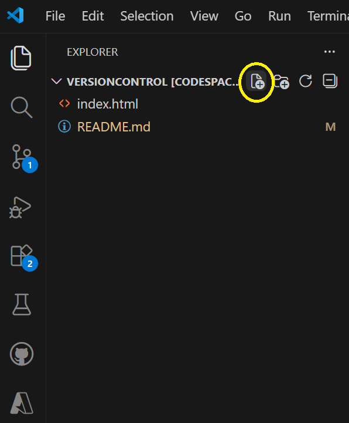
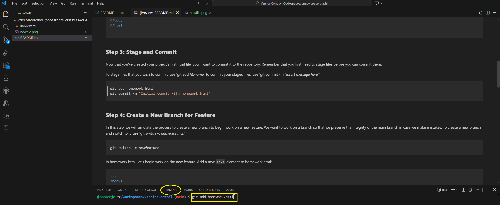

Here’s the updated Markdown file with a **quick summary of Git concepts** added at the top, along with the branching diagram:

***

# Git Basics Exercise: Staging, Committing, and Branching

## **Quick Summary of Git Concepts**

*   **Repository**: A storage space for your project and its version history.
*   **Staging**: Selecting changes you want to include in the next commit using `git add`.
*   **Commit**: Saving a snapshot of your staged changes to the repository using `git commit`.
*   **Branch**: A separate line of development that allows you to work on new features or fixes without affecting the main branch.
*   **Merge**: Combining changes from one branch into another.


***

## **Step 1: Create the HTML File**

Create `homework.html`



To `homework.html` add the following html:

```html
<!DOCTYPE html>
<html lang="en-US">
<head>
    <title>git Branching Exercise</title>
    <meta charset="UTF-8">
    <style>
        body { font-family: Arial, Helvetica, sans-serif; }
    </style>
</head>
<body>
    <h1 style="background-color:grey;">Basics of git</h1>
    <!-- Add some more stuff here-->
</body>
</html>

```


***

## **Step 2: Stage and Commit**
Now that you've created your project's first html file, you'll want to commit it to the repository.<br>
Remember that you first need to stage files before you can commit them.

To stage files that you wish to commit, use 'git add _filename_'<br>
To commit your staged files, use 'git commit -m "_Insert message here_"'

```bash
git add homework.html
git commit -m "Initial commit with homework.html"
```

Remember, to execute git commands, use the command line in `TERMINAL`




***

## **Step 3: Create a New Branch for Feature**
In this step, we will simulate the process to create a new branch to begin work on a new feature.<br>
We want to work on a new branch so that we preserve the integrity of the main branch in case we make mistakes.<br>
To create a new branch and switch to it, use 'git switch -c _nameofbranch_'<br>
```bash
git switch -c newfeature
```

In homework.html, let's begin work on the new feature. Add a new `<h2>` element to homework.html:
```html
...
<body>
    <h1 style="background-color:grey;">Basics of git</h1>
    <h2>Here is the new feature!</h2>
</body>
...
```

***

## **Step 4: Bug Fix Workflow**
Here we will simulate an urgent request that needs immediate attention.<br>
The customer calls and needs you to immediately fix a problem. They want the background color of the `<h1>` element to be blue instead of gray.<br>
You will need to stop work on the newfeature and immediately fix the customer request.<br>
First, you need to preserve your work on the newfeature branch. Commit your changes to this branch.<br>
```bash
git add homework.html
git commit -m "Added h2 element for new feature"
```

Now switch to `main` and create a `bugfix` branch where you will address the customer issue:

```bash
git switch main
git switch -c bugfix
```

In `homework.html` change the `<h1>` background to blue.
```html
...
<body>
    <h1 style="background-color:blue;">Basics of git</h1>
    <!-- Add some more stuff here-->
</body>
...
```

Now stage and commit the bug fixes.

```bash
git add homework.html
git commit -m "Changed h1 background color to blue"
```

# Merge bugfix into main
To merge a branch, first we switch into the branch we with to merge _into_.

```bash
git switch main
```

Then we specify the name of the branch we with to merge into currently selected branch:
```bash
git merge bugfix
```
***

## **Step 5: Finish the New Feature and Merge Into Main**

Switch back to `newfeature` branch to continue work there.<br>
```bash
git switch newfeature
```

Add an `<h3>` element to finish the new feature

```html
...
<body>
    <h1 style="background-color:grey;">Basics of git</h1>
    <h2>Here is the new feature!</h2>
    <h3>This is the end of the new feature</h3>
</body>
...
```

Commit the finalized new feature to the `newfeature` branch:

```bash
git add homework.html
git commit -m "Added h3 element for new feature"
```

Merge `newfeature` into `main`:

```bash
git switch main
git merge newfeature
```

Resolve conflicts.

***

### **Congratulations!**

You have successfully:

*   Staged and committed changes.
*   Created and merged branches.
*   Managed multiple updates without conflicts.

***

